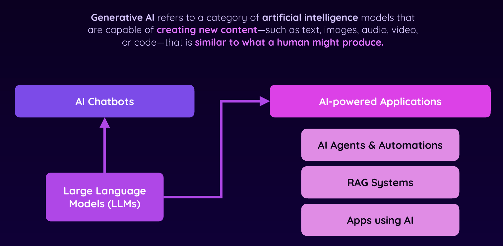
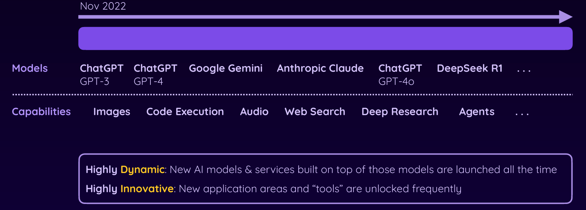

# Chính xác Generative AI là gì?

- Generative AI là một loại mô hình trí tuệ nhân tạo
có khả năng tạo ra nội dung mới—chẳng hạn như văn bản, hình ảnh, âm thanh, video hoặc mã—tương tự như những gì con người có thể tạo ra.

# Cuộc cách mạng Generative AI

# Những cách sử dụng Generative AI

