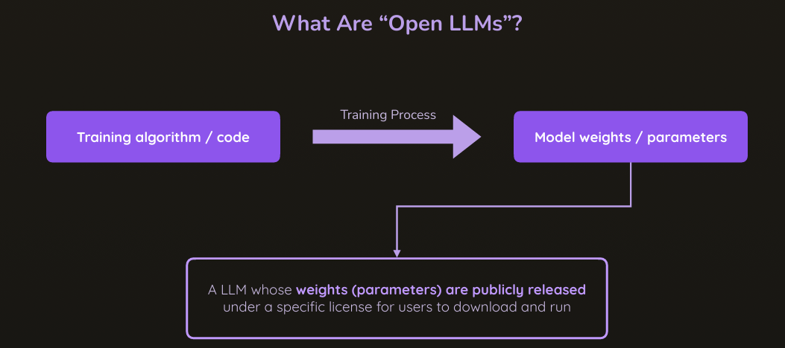
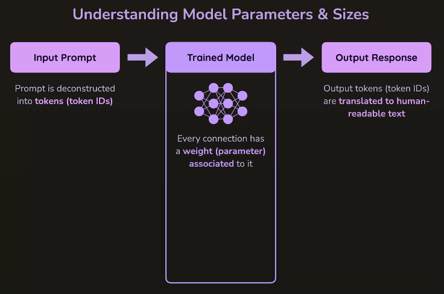
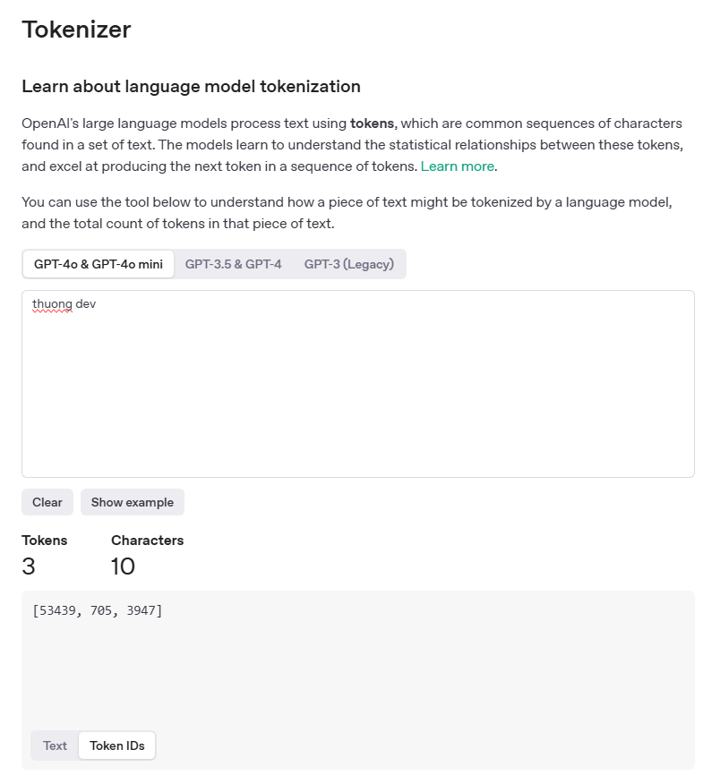
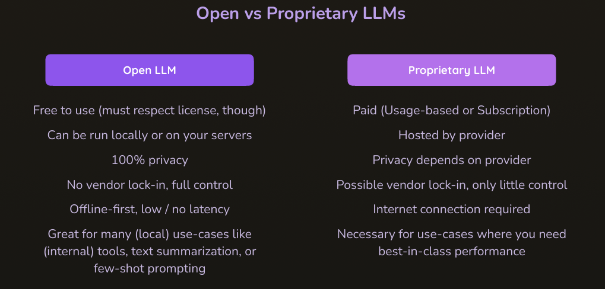
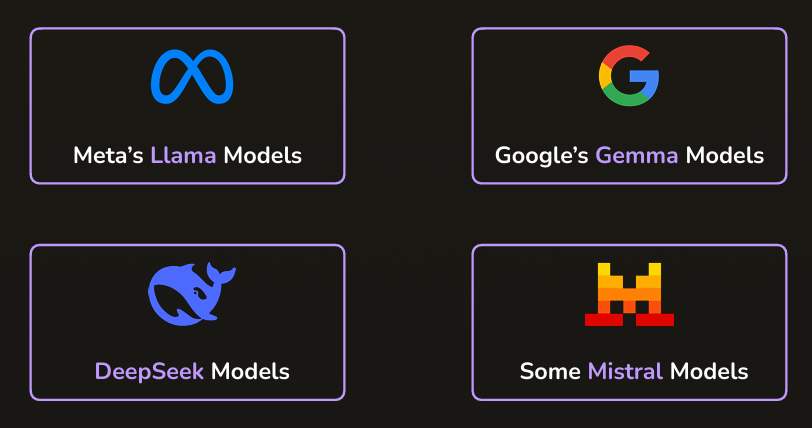

# Chính xác "Open LLM" là gì?

- Open LLM là một thuật ngữ được sử dụng để mô tả các mô hình ngôn ngữ lớn (LLM) mã nguồn mở, có thể được tải xuống và chạy trên máy tính cá nhân hoặc máy chủ. Những mô hình này thường được phát triển bởi cộng đồng mã nguồn mở và có thể được sử dụng cho nhiều mục đích khác nhau, bao gồm xử lý ngôn ngữ tự nhiên, tạo văn bản, dịch thuật, và nhiều ứng dụng AI khác.
- Qua quá trình tranning bởi các thuật toán và mã hóa, chúng ta có kết quả là những mô hình ngôn ngữ lớn (LLM) có khả năng hiểu và tạo ra văn bản tự nhiên. Những mô hình này có thể được sử dụng trong nhiều lĩnh vực khác nhau, từ chatbot đến phân tích văn bản.
- Các mô hình LLM được xác định bởi các trọng số hoặc các tham số mà chúng được học trong quá trình huấn luyện:
  - VD: DeepSeek là mô hình với hơn 70 tỷ tham số, trong khi Llama 2 có 7 tỷ tham số.

# LLMs làm việc như thế nào?

- LLMs hoạt động dựa trên kiến trúc mạng nơ-ron sâu, thường là Transformer, để xử lý và tạo ra văn bản. Chúng được huấn luyện trên một lượng lớn dữ liệu văn bản để học cách dự đoán từ tiếp theo trong một câu hoặc đoạn văn.
- Quá trình này bao gồm việc phân tích ngữ cảnh, cấu trúc ngữôn ngữ, và các mối quan hệ giữa các từ. Khi nhận được một đầu vào, LLM sẽ sử dụng kiến thức đã học để tạo ra văn bản phù hợp với ngữ cảnh đó.
- Khi bạn cung cấp đầu vào cho 1 LLM, văn bản của bạn sẽ được huyển đổi thành các tokens, các tokens này có thể là 1 từ hoặc 1 phần của từ đó. Các tokens sẽ được đưa vào mô hình LLM đã được đào tạo trước đó. Mô hình sẽ phân tích các tokens này và dự đoán từ tiếp theo dựa trên ngữ cảnh đã học

- LLMs thực sự chỉ là những mô hình thống kê, tạo ra các tokens đầu ra và dựa trên xác suất để quyết định từ tiếp theo trong chuỗi văn bản.

# Tại sao chúng ta lại muốn sử chạy Open LLMs trên máy tính cá nhân?

- Việc chạy Open LLMs trên máy tính cá nhân mang lại nhiều lợi ích, bao gồm:
  - **Bảo mật và quyền riêng tư**: Dữ liệu của bạn không cần phải gửi lên máy chủ bên ngoài, giúp bảo vệ thông tin cá nhân và nhạy cảm.
  - **Tùy chỉnh**: Bạn có thể tùy chỉnh mô hình theo nhu cầu cụ thể của mình, từ việc điều chỉnh tham số đến việc huấn luyện lại mô hình với dữ liệu riêng.
  - **Tiết kiệm chi phí**: Không cần phải trả tiền cho dịch vụ đám mây hoặc API, bạn có thể sử dụng tài nguyên máy tính của mình để chạy mô hình.
  - **Khả năng truy cập**: Bạn có thể sử dụng mô hình ngay cả khi không có kết nối internet.

# Các mô hình LLM phổ biến

- **Llama 2**: Mô hình mã nguồn mở của Meta, có nhiều phiên bản với kích thước khác nhau (7B, 13B, 70B tham số).
- **DeepSeek**: Mô hình LLM của DeepSeek, có khả năng xử lý ngôn ngữ tự nhiên và tạo văn bản với hiệu suất cao.
- **Mistral**: Mô hình LLM mã nguồn mở với khả năng tạo ra văn bản tự nhiên và hiểu ngữ cảnh tốt.
- **Gemma**: Mô hình LLM của Cohere, được thiết kế để tạo ra văn bản tự nhiên và có khả năng hiểu ngữ cảnh.

# Chúng ta có thể tìm kiếm các mô hình LLM ở đâu?

- Các mô hình LLM mã nguồn mở có thể được tìm thấy trên các nền tảng như:
  - [Hugging Face](https://huggingface.co/models): Nơi tập trung nhiều mô hình LLM mã nguồn mở, bao gồm Llama 2, DeepSeek, Mistral, Gemma và nhiều mô hình khác.
  - [GitHub](https://github.com): Nơi các nhà phát triển chia sẻ mã nguồn và mô hình LLM của họ.
  - [Papers with Code](https://paperswithcode.com): Cung cấp thông tin về các mô hình LLM cùng với mã nguồn và dữ liệu huấn luyện.
- Ngoài ra, bạn cũng có thể tìm kiếm các mô hình LLM trên các trang web của các công ty công nghệ lớn như Google, Microsoft, và OpenAI, nơi họ thường công bố các mô hình và nghiên cứu mới nhất của mình.
