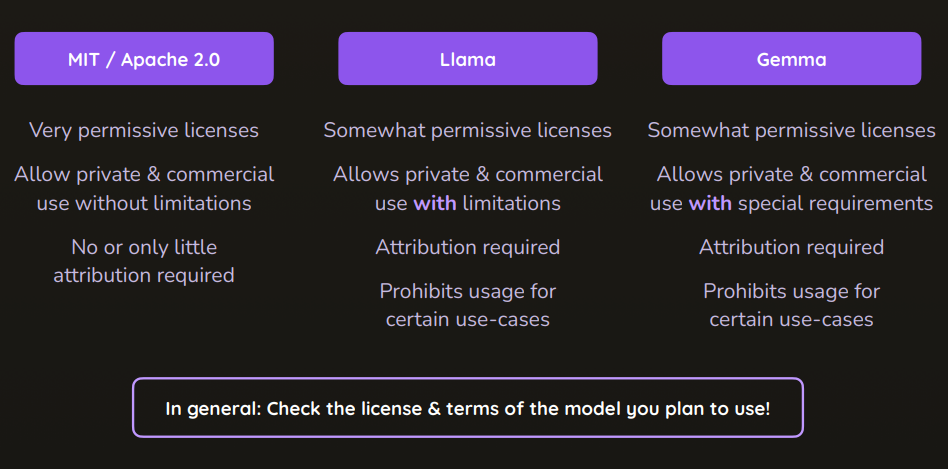

# Chính xác "Open LLM" là gì?

- Open LLM là một thuật ngữ được sử dụng để mô tả các mô hình ngôn ngữ lớn (LLM) mã nguồn mở, có thể được tải xuống và chạy trên máy tính cá nhân hoặc máy chủ. Những mô hình này thường được phát triển bởi cộng đồng mã nguồn mở và có thể được sử dụng cho nhiều mục đích khác nhau, bao gồm xử lý ngôn ngữ tự nhiên, tạo văn bản, dịch thuật, và nhiều ứng dụng AI khác.
- Qua quá trình tranning bởi các thuật toán và mã hóa, chúng ta có kết quả là những mô hình ngôn ngữ lớn (LLM) có khả năng hiểu và tạo ra văn bản tự nhiên. Những mô hình này có thể được sử dụng trong nhiều lĩnh vực khác nhau, từ chatbot đến phân tích văn bản.
- Các mô hình LLM được xác định bởi các trọng số hoặc các tham số mà chúng được học trong quá trình huấn luyện:
  - VD: DeepSeek là mô hình với hơn 70 tỷ tham số, trong khi Llama 2 có 7 tỷ tham số.

# LLMs làm việc như thế nào?

- LLMs hoạt động dựa trên kiến trúc mạng nơ-ron sâu, thường là Transformer, để xử lý và tạo ra văn bản. Chúng được huấn luyện trên một lượng lớn dữ liệu văn bản để học cách dự đoán từ tiếp theo trong một câu hoặc đoạn văn.
- Quá trình này bao gồm việc phân tích ngữ cảnh, cấu trúc ngữôn ngữ, và các mối quan hệ giữa các từ. Khi nhận được một đầu vào, LLM sẽ sử dụng kiến thức đã học để tạo ra văn bản phù hợp với ngữ cảnh đó.
- Khi bạn cung cấp đầu vào cho 1 LLM, văn bản của bạn sẽ được huyển đổi thành các tokens, các tokens này có thể là 1 từ hoặc 1 phần của từ đó. Các tokens sẽ được đưa vào mô hình LLM đã được đào tạo trước đó. Mô hình sẽ phân tích các tokens này và dự đoán từ tiếp theo dựa trên ngữ cảnh đã học

- LLMs thực sự chỉ là những mô hình thống kê, tạo ra các tokens đầu ra và dựa trên xác suất để quyết định từ tiếp theo trong chuỗi văn bản.

# Tại sao chúng ta lại muốn sử chạy Open LLMs trên máy tính cá nhân?

- Việc chạy Open LLMs trên máy tính cá nhân mang lại nhiều lợi ích, bao gồm:
  - **Bảo mật và quyền riêng tư**: Dữ liệu của bạn không cần phải gửi lên máy chủ bên ngoài, giúp bảo vệ thông tin cá nhân và nhạy cảm.
  - **Tùy chỉnh**: Bạn có thể tùy chỉnh mô hình theo nhu cầu cụ thể của mình, từ việc điều chỉnh tham số đến việc huấn luyện lại mô hình với dữ liệu riêng.
  - **Tiết kiệm chi phí**: Không cần phải trả tiền cho dịch vụ đám mây hoặc API, bạn có thể sử dụng tài nguyên máy tính của mình để chạy mô hình.
  - **Khả năng truy cập**: Bạn có thể sử dụng mô hình ngay cả khi không có kết nối internet.

# Các mô hình LLM phổ biến

- **Llama 2**: Mô hình mã nguồn mở của Meta, có nhiều phiên bản với kích thước khác nhau (7B, 13B, 70B tham số).
- **DeepSeek**: Mô hình LLM của DeepSeek, có khả năng xử lý ngôn ngữ tự nhiên và tạo văn bản với hiệu suất cao.
- **Mistral**: Mô hình LLM mã nguồn mở với khả năng tạo ra văn bản tự nhiên và hiểu ngữ cảnh tốt.
- **Gemma**: Mô hình LLM của Cohere, được thiết kế để tạo ra văn bản tự nhiên và có khả năng hiểu ngữ cảnh.

# Chúng ta có thể tìm kiếm các mô hình LLM ở đâu?

- Các mô hình LLM mã nguồn mở có thể được tìm thấy trên các nền tảng như:
  - [Hugging Face](https://huggingface.co/models): Nơi tập trung nhiều mô hình LLM mã nguồn mở, bao gồm Llama 2, DeepSeek, Mistral, Gemma và nhiều mô hình khác.
  - [GitHub](https://github.com): Nơi các nhà phát triển chia sẻ mã nguồn và mô hình LLM của họ.
  - [Papers with Code](https://paperswithcode.com): Cung cấp thông tin về các mô hình LLM cùng với mã nguồn và dữ liệu huấn luyện.
- Ngoài ra, bạn cũng có thể tìm kiếm các mô hình LLM trên các trang web của các công ty công nghệ lớn như Google, Microsoft, và OpenAI, nơi họ thường công bố các mô hình và nghiên cứu mới nhất của mình.

# Running LLMs Locally như thế nào ?

- LM Studio và Ollama đều dựa trên Llama.cpp
- Llama.cpp là một thư viện mã nguồn mở cho phép chạy các mô hình LLM trên máy tính cá nhân mà không cần GPU, sử dụng CPU hoặc GPU với hiệu suất cao.

# Check model License

- Trước khi sử dụng mô hình LLM, bạn nên kiểm tra giấy phép của mô hình đó để đảm bảo rằng bạn tuân thủ các điều khoản và điều kiện sử dụng. Các mô hình LLM thường có các giấy phép khác nhau, từ giấy phép mã nguồn mở cho đến giấy phép thương mại.
  - MIT/Apache
  - Llama
  - Gemma

# Yêu cầu về phần cứng của hệ thống & Quantization(Lượng tử hóa)

- Để chạy các mô hình LLM trên máy tính cá nhân, bạn cần đảm bảo rằng hệ thống của bạn đáp ứng các yêu cầu phần cứng tối thiểu. Các yêu cầu này có thể khác nhau tùy thuộc vào mô hình cụ thể mà bạn muốn sử dụng.

- Để làm điều đó chúng ta sẽ cần hiểu:
  - Model Parameters & Size
  - Yêu cầu về phần cứng
  - Quantization (Lượng tử hóa)

## LLM Hardware Requirements

- Chúng ta sẽ cần phải tìm ra phần cứng mà chúng ta cần
- Chúng ta cũng cần 1 mô hình LLM đã được huấn luyện trước đó để tạo ra các tokens đầu ra
- Các mô hình khi nhận đầu vào sẽ cần thực hiện rất nhiều các phép toán song song để tạo ra đầu ra và GPUs là tuyệt vời trong việc thự hiện các phép toán song song này
- VRAM của GPU là bộ nhớ mà mô hình LLM sẽ sử dụng để lưu trữ các trọng số và tham số của nó trong quá trình chạy
- Đảm bảo rằng hệ thống của bạn có đủ VRAM để chạy mô hình LLM một cách hiệu quả
- GPU và VRAM có sẽ tốt hơn nhưng không có cũng không có vấn đề gì quá lớn => Chọn những mô hình nhỏ hơn, hoặc sẽ cần tìm hiểu các làm giảm yêu cầu về phần cứng của mô hình LLM

- Thứ được tải vào bộ nhớ khi thực hiện suy luận cuối cùng là các các trọng số (weights) của mô hình LLM
- Một mô hình ngôn ngữ lớn là một mạng nơ-ron với hàng triệu hoặc thậm chí hàng tỷ trọng số, và mỗi trọng số này cần được lưu trữ trong bộ nhớ để mô hình có thể hoạt động.
- Mỗi parameters đều là các giá trị số thực (floating-point numbers), và kích thước của chúng phụ thuộc vào định dạng mà mô hình sử dụng (ví dụ: 32-bit, 16-bit, v.v.) và mỗi trọng số sẽ chiếm một lượng bộ nhớ nhất định thường là 4 bytes cho mỗi trọng số 32-bit và 2 bytes cho mỗi trọng số 16-bit.
- Do đó, tổng kích thước của mô hình LLM sẽ được tính bằng công thức:
  - **Kích thước mô hình (bytes) = Số lượng tham số * Kích thước mỗi tham số (bytes)**
  - Ngay cả khi bạn chỉ có một mô hình 2 tỷ tham số nó vẫn sẽ cần lấy của bạn từ 4-8GB VRAM để chạy mô hình đó

## Làm thế nào để giảm yêu cầu về phần cứng của mô hình LLM?

- Có 1 giải pháp gọi là **Quantization** (Lượng tử hóa) - Là quá trình chuyển đổi các trọng số của mô hình từ định dạng số thực sang định dạng số nguyên, giúp giảm kích thước mô hình và yêu cầu về bộ nhớ.

- Quá trình này có thể nén mô hình xuống còn 1/4 kích thước ban đầu mà không làm giảm đáng kể hiệu suất của mô hình.

- Mô hình nên dùng: <https://huggingface.co/google/gemma-3-27b-it-qat-q4_0-gguf>

- Tạo tài khoản Hugging Face và cung các thông số  GPU và CPU của máy tính bạn để check mô hình nào phù hợp với bạn:
  - <https://huggingface.co/spaces/huggingface-projects/llm-quantization>
  - <https://huggingface.co/settings/local-apps>

# LM Studio

- LLM Studio là một ứng dụng mã nguồn mở cho phép bạn chạy các mô hình LLM trên máy tính cá nhân một cách dễ dàng. Nó cung cấp giao diện người dùng thân thiện và hỗ trợ nhiều mô hình khác nhau, bao gồm cả Llama 2, DeepSeek, Mistral, Gemma và nhiều mô hình khác:
  - Installing LM Studio:
    - Download LM Studio from the official website: <https://lmstudio.ai/>
    - Follow the installation instructions for your operating system (Windows, macOS, Linux).
    - Cài đặt các setting cơ bản:
      - Ngôn ngữ
  - Advanced Configuration Options
  - Các trường hợp sử dụng hoặc các kịch bản sử dụng
  - Programmatic Usage

## Install LM Studio

- Download và cài đăt từ trang chủ của LM Studio: [LM Studio](https://lmstudio.ai/)
- Chọn và tải những Model phù hợp với máy tính của bạn
- Cài đặt các mô hình LLM mà bạn muốn sử dụng trong LM Studio

## Advanced Configuration Options

- Tương tự chat GPT ( giống khoảng 80% )
- Xử lí dạng đầu ra cho câu trả lời của mô hình LLM sử dung Appearance
- Duplicate các cuộc trò chuyện để có thể sử dụng lại các cuộc trò chuyện trước đó theo 1 cách khác
- Clear all các cuộc trò chuyện để bắt đầu lại từ đầu
- System Prompt: Làm cho mô hình LLM hiểu rõ hơn về ngữ cảnh của cuộc trò chuyện: Là 1 phần của mỗi cuộc trò chuyện nhưng chúng sẽ được ưu tiên

### Làm việc với system prompt và Presets

- Cung cấp thêm các chỉ dẫn cho mô hình LLM để nó có thể hiểu rõ hơn về ngữ cảnh của cuộc trò chuyện
- Presets là các mẫu đã được định sẵn để giúp bạn bắt đầu nhanh chóng với các cuộc trò chuyện
- Bạn có thể tạo và lưu các Presets của riêng mình để sử dụng trong các cuộc trò chuyện sau này

### Managing Chats

- Có thể quản lý các cuộc trò chuyện của bạn bằng cách:
  - Tạo mới, duplicate hoặc xóa các cuộc trò chuyện
  - Sắp xếp các cuộc trò chuyện theo thứ tự ưu tiên hoặc theo ngày tạo
  - Tìm kiếm các cuộc trò chuyện dựa trên từ khóa hoặc nội dung
  - Sử dụng role: User, Power User, Developer
- Tạo các Folder để tổ chức các cuộc trò chuyện của bạn theo chủ đề hoặc dự án
- Bạn có thể sử dụng để tạo ra các cuộc trò chuyện mới base trên 1 phần các cuộc trò chuyện trước đó (Branch Conversations)

- Khi sử dụng những Role như Power User, Developer bạn sẽ có thêm 1 thanh công cụ bên dưới để có thể sử dụng các chức năng như:

# Sử dụng tương đối giống với ChatGPT - Có thời gian sẽ viết thêm
